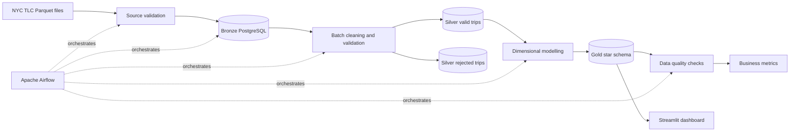

# NYC Yellow Taxi Batch ETL Pipeline

An end-to-end batch data engineering project that ingests NYC Yellow Taxi
Parquet files, applies data quality and business transformations through a
Medallion Architecture, builds a dimensional PostgreSQL warehouse, and serves
analytics through a Streamlit dashboard.

The pipeline processes **5.98 million source records** for January and February
2023. It is orchestrated with Apache Airflow and includes incremental loading,
rejected-record traceability, reconciliation checks, structured logging, and
unit tests.

## Project highlights

- Processes **5,980,721** source rows in memory-controlled batches.
- Publishes **5,930,240** validated trips to the Gold fact table.
- Quarantines **50,481** invalid or out-of-period rows with rejection reasons.
- Implements idempotent Bronze, Silver, and Gold loading patterns.
- Runs **16 automated data quality checks** before metrics are considered ready.
- Models analytics data as a star schema with date, location, payment, and vendor dimensions.
- Orchestrates the complete workflow with Apache Airflow 3.
- Includes a Streamlit dashboard backed directly by the Gold warehouse layer.
- Covers transformation, loading, configuration, logging, and quality logic with **27 unit tests**.

## Architecture



### Pipeline flow

1. **Validate source** — confirms both Parquet files exist and contain records.
2. **Bronze ingestion** — reads Parquet with PyArrow and loads PostgreSQL in
   50,000-row batches while recording file-level audit status.
3. **Silver transformation** — standardizes timestamps, validates business
   rules, derives pickup date/hour and trip duration, and separates invalid
   rows into a rejection table.
4. **Gold modelling** — loads conformed dimensions and a trip-level fact table
   using surrogate keys.
5. **Quality gates** — checks completeness, validity, uniqueness, reporting
   boundaries, and cross-layer row-count reconciliation.
6. **Analytics** — exposes business SQL and an interactive Streamlit dashboard.

## Technology stack

| Area | Technology |
|---|---|
| Language | Python 3.12 |
| Orchestration | Apache Airflow 3 |
| Processing | Pandas, PyArrow |
| Warehouse | PostgreSQL 17 |
| Data access | SQLAlchemy, psycopg2 |
| Dashboard | Streamlit |
| Infrastructure | Docker Compose |
| Package management | uv |
| Testing and quality | pytest, Ruff |

## Data model

The Gold layer uses a star schema at the grain of one validated taxi trip.

| Table | Purpose |
|---|---|
| `gold.fact_taxi_trips` | Trip measures, timestamps, derived attributes, and dimension keys |
| `gold.dim_date` | Calendar attributes including quarter, weekday, and weekend flag |
| `gold.dim_location` | Source pickup and drop-off location identifiers |
| `gold.dim_payment_type` | Human-readable payment classifications |
| `gold.dim_vendor` | Taxi technology provider details |

The earlier layers retain operational lineage:

- `bronze.taxi_trips` stores source-aligned records.
- `bronze.ingestion_audit` tracks file-level processing and row counts.
- `silver.taxi_trips` stores validated, analysis-ready records.
- `silver.rejected_taxi_trips` preserves rejected record IDs and reasons.

## Verified run results

The following results were produced by the local January–February 2023 run:

| Metric | Result |
|---|---:|
| Source/Bronze rows | 5,980,721 |
| Validated Silver rows | 5,930,240 |
| Rejected rows | 50,481 |
| Gold fact rows | 5,930,240 |
| Total revenue | $162,431,031.73 |
| Average fare per mile | $4.72 |
| Automated quality checks | 16 |
| Unit tests | 27 passing |

## Data quality strategy

Invalid records are quarantined rather than silently dropped. Validation covers:

- Missing or invalid pickup/drop-off timestamps.
- Drop-off timestamps earlier than pickup timestamps.
- Records outside the January–February 2023 reporting window.
- Missing or negative trip distance, fare, and total amounts.
- Missing pickup and drop-off locations.
- Duplicate fact-level source identifiers.
- Null required keys in the dimensional model.
- Bronze-to-Silver/rejected and Silver-to-Gold reconciliation.

A failed warehouse check raises a `DataQualityError`, causing the Airflow task
and downstream workflow to fail visibly.

## Reliability and idempotency

- Bronze ingestion uses a file-level audit table and skips completed files.
- Silver reads only Bronze rows that are absent from both valid and rejected tables.
- Gold dimension and fact loads use PostgreSQL conflict handling to avoid duplicates.
- Database writes run inside managed transactions and roll back on failure.
- Airflow applies task retry behavior and preserves task-level operational logs.

## Repository structure

```text
nyc-taxi-etl/
├── airflow/
│   ├── dags/                     # Airflow DAG definition
│   ├── config/
│   ├── logs/
│   └── plugins/
├── dashboard/
│   └── app.py                    # Streamlit analytics dashboard
├── data/raw/                     # Downloaded TLC Parquet files (gitignored)
├── sql/
│   ├── schema.sql                # Bronze, Silver, and Gold DDL
│   └── business_metrics.sql      # Analytical SQL queries
├── src/nyc_taxi_etl/
│   ├── bronze/loader.py          # Batched source ingestion
│   ├── silver/transformer.py     # Cleaning, validation, and rejection logic
│   ├── gold/loader.py            # Star-schema loading
│   ├── quality/checks.py         # Post-load quality gates
│   ├── config.py                 # Environment-based settings
│   ├── database.py               # Engine and transaction management
│   └── logging_config.py         # Structured logging configuration
├── tests/unit/                   # Unit test suite
├── .env.example                  # Local configuration template
├── docker-compose.yml            # PostgreSQL and Airflow services
├── Dockerfile.airflow            # Custom Airflow runtime image
├── pyproject.toml                # Dependencies and project metadata
└── setup.sh                      # Local bootstrap and data download
```

## Local setup

### Prerequisites

- Docker Desktop
- Python 3.12
- [uv](https://docs.astral.sh/uv/)
- `curl`

### 1. Bootstrap the repository

```bash
cd nyc-taxi-etl
chmod +x setup.sh
./setup.sh
```

The setup script installs Python dependencies, creates `.env`, starts the
warehouse, and downloads the January and February 2023 Yellow Taxi files from
the official NYC TLC source.

### 2. Create the warehouse schema

```bash
docker exec -i nyc-taxi-warehouse \
  psql -U nyc_taxi -d nyc_taxi < sql/schema.sql
```

### 3. Start Airflow

```bash
docker compose up -d --build
```

Open [http://localhost:8080](http://localhost:8080), locate
`nyc_taxi_batch_etl`, and trigger the DAG.

The DAG executes this dependency chain:

```text
validate_source_files
  → load_bronze
  → transform_silver
  → load_gold
  → run_data_quality_checks
  → calculate_business_metrics
```

### 4. Run the dashboard

After the DAG completes successfully:

```bash
uv run streamlit run dashboard/app.py
```

Open [http://localhost:8501](http://localhost:8501).

> The project maps PostgreSQL to host port `5434` to avoid conflicts with a
> standard local PostgreSQL installation. Containers communicate with the
> warehouse internally through `warehouse-db:5432`.

## Development checks

Run the test suite:

```bash
uv run pytest -q
```

Run lint checks:

```bash
uv run ruff check .
```

Current verified status:

```text
27 passed
All checks passed!
```

## Business questions answered

The curated Gold layer supports questions such as:

- What is the average fare generated per travelled mile?
- Which pickup hours have the highest taxi demand?
- How does trip volume and revenue vary by payment type?
- What are total trip volume and revenue for the reporting period?

Reference queries are available in [`sql/business_metrics.sql`](sql/business_metrics.sql).

## Engineering decisions and trade-offs

- **PostgreSQL for all layers:** keeps local deployment reproducible and makes
  lineage easy to inspect. At larger scale, Bronze data would typically remain
  in object storage and transformations would run on distributed compute.
- **Batch-based Pandas processing:** limits memory usage and demonstrates
  incremental database loading without requiring a cluster.
- **Explicit rejected-record storage:** prioritizes auditability over simply
  filtering invalid records.
- **Star schema in Gold:** separates analytical concerns from operational
  ingestion and keeps dashboard queries straightforward.

## Production evolution

For a production deployment, the next steps would be partitioned object
storage, secrets management, CI/CD, automated backfills, SLA monitoring,
centralized observability, and a transformation framework such as dbt for
warehouse model lineage and documentation.

## Data source

[NYC Taxi & Limousine Commission Trip Record Data](https://www.nyc.gov/site/tlc/about/tlc-trip-record-data.page)

This repository uses the January and February 2023 Yellow Taxi Parquet files.

## Author

**Usman Ahamed**<br>
Data Engineer<br>
[ahmeduzman432@gmail.com](mailto:ahmeduzman432@gmail.com)
